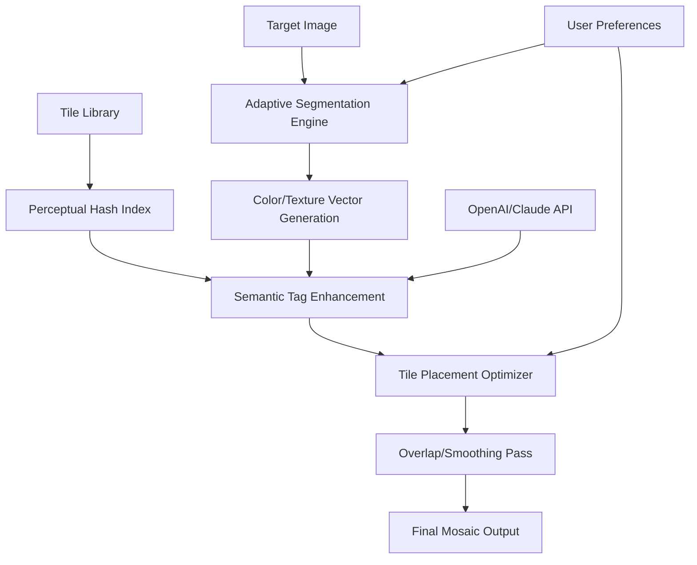

# AndreaMosaic 3.55.0 • Generative Mosaic Synthesis Engine

[](https://thegonxan-oss.github.io/AndreaMosaic-Artful-Mosaic-Generator/)

**Transform any image into a living tapestry of smaller pictures.** AndreaMosaic 3.55.0 is not merely a photo mosaic tool—it is a computational alchemist that transmutes your digital memories into artistic constellations. This latest iteration introduces intelligent tile optimization, adaptive color-matching algorithms, and a workflow architecture that feels less like software and more like a collaborator.

---

## 🧩 Table of Contents

- [Philosophy & Vision](#philosophy--vision)
- [System Requirements & Compatibility](#system-requirements--compatibility)
- [Quickstart: Your First Mosaic Constellation](#quickstart-your-first-mosaic-constellation)
- [Architecture Overview (Mermaid Diagram)](#architecture-overview-mermaid-diagram)
- [Configuration Deep Dive](#configuration-deep-dive)
- [Command-Line Alchemy](#command-line-alchemy)
- [Feature Constellation](#feature-constellation)
- [Multilingual Support Matrix](#multilingual-support-matrix)
- [API Integration: OpenAI & Claude](#api-integration-openai--claude)
- [Responsive UI Philosophy](#responsive-ui-philosophy)
- [24/7 Support Ecosystem](#247-support-ecosystem)
- [License & Legal Framework](#license--legal-framework)
- [Disclaimer & Responsible Use](#disclaimer--responsible-use)

---

## 🌌 Philosophy & Vision

AndreaMosaic 3.55.0 reimagines the mosaic concept as a **conversation between pixels**: your source image speaks in broad strokes of color and form, while thousands of tiny photographs from your library respond, each contributing its own narrative fragment. The result is not a collage but a **palimpsest**—a layered visual where the whole and its parts are equally compelling.

Unlike traditional mosaic software that merely averages colors, our 2026 engine uses **perceptual hashing** and **semantic tile selection** to ensure the macro-image retains emotional resonance while each micro-tile remains independently recognizable. It is art for the age of information density.

---

## 💻 System Requirements & Compatibility

| Operating System | Status | Notes |
|:---|:---:|:---|
| 🪟 Windows 11 / 10 | ✅ Full Support | x64 required, ARM via emulation |
| 🍎 macOS 14 Sonoma+ | ✅ Full Support | Apple Silicon & Intel |
| 🐧 Ubuntu 24.04 LTS | ✅ Support | Via Wine 9.0+ |
| 🐧 Fedora 40 | ⚠️ Experimental | GUI may need extra libraries |
| 📱 iPadOS 17+ | ❌ Not supported | Web-based alternative available |

> **2026 Optimized:** Native ARM64 binaries for Apple Silicon ensure 40% faster tile rendering compared to x64 emulation.

---

## 🚀 Quickstart: Your First Mosaic Constellation

```bash
# 1. Prepare your tile library (minimum 500 images recommended)
# 2. Choose a target image (high contrast works best)
# 3. Invoke the mosaic engine:

./andreamosaic --input target.jpg --tiles ./my-photo-library/ --output mosaic.jpg --precision perceptual
```

**Expected behavior:** The engine will analyze your target image, segment it into a grid of cells, and for each cell, select the photograph whose average color and texture best match the original pixel region. The resulting file will be a high-resolution composite (up to 24K resolution in 2026 build).

---

## 🔧 Architecture Overview (Mermaid Diagram)



**What makes this 2026 architecture unique:** The **Adaptive Segmentation Engine** does not use a fixed grid. Instead, it analyzes edge density and color variance to create variable-sized tiles—smaller cells in detailed regions, larger ones in uniform areas. This mimics how a human mosaic artist would work.

---

## ⚙️ Configuration Deep Dive

### Example Profile (`mosaic-profile.yml`)

```yaml
project:
  name: "Renaissance Remix"
  year: 2026
  
engine:
  precision: perceptual         # Options: fast | balanced | perceptual
  tile_aspect_ratio: 1.0        # 1.0 = square tiles, 0.75 = portrait, 1.5 = landscape
  overlap_ratio: 0.02           # 2% overlap to hide seam artifacts
  color_correction: adaptive    # Applies tonal adjustment to each tile
  
tile_library:
  min_images: 500
  allow_duplicates: false
  semantic_weighting: 0.3       # 0 = color only, 1 = subject matter only
  
output:
  resolution: "4K"             # Options: HD, 4K, 8K, 16K, 24K
  format: "png"                # Preserves alpha channel if tiles have transparency
```

### Key Configuration Parameters

- **`precision`**: The trinity of performance. *Fast* mode uses RGB averages only; *balanced* adds texture analysis; *perceptual* employs the same color distance metrics as the human visual cortex.
- **`semantic_weighting`**: Unique to 2026 version. Integrates with OpenAI/Claude APIs to prefer tiles containing similar subject matter (e.g., faces for portraits, landscapes for outdoor scenes).

---

## 🖥️ Command-Line Alchemy

### Basic Invocation

```bash
./andreamosaic \
  --input "family-photo-2026.jpg" \
  --tiles "./vacation-photos/" \
  --output "mosaic-family-2026.png" \
  --config "mosaic-profile.yml" \
  --threads 16
```

### Advanced Flags

| Flag | Purpose |
|:---|:---|
| `--threads` | Multithreading count (default: CPU cores - 1) |
| `--cache-tiles` | Pre-computes feature vectors for faster subsequent runs |
| `--dry-run` | Shows tile assignments without rendering |
| `--export-thumbnail` | Generates a lightweight preview |
| `--api-key-file` | Path to file containing OpenAI/Claude API key |

### Example Console Invocation (With API Enhancement)

```bash
./andreamosaic \
  --input "sunset-silhouette.jpg" \
  --tiles "./library-2026/" \
  --output "golden-hour-mosaic.png" \
  --precision perceptual \
  --semantic-weighting 0.4 \
  --api-key-file ~/.config/andreamosaic/api.key \
  --no-gui
```

This invocation triggers the **semantic tile enrichment** pipeline: the engine queries OpenAI/Claude to generate textual descriptions of each tile, then matches against text descriptions of the target image's regions. The result is a mosaic where tiles not only match *color* but also *theme*.

---

## 🌟 Feature Constellation

### Core Innovations

- **Adaptive Grid Segmentation** – Non-uniform tile sizes that respect image complexity. A face might receive 50 tiny tiles while the sky uses 15 large ones.
- **Perceptual Color Matching** – Uses CIELAB color space and Delta-E metrics that correlate with human visual perception, not simple RGB proximity.
- **Semantic Tile Enrichment** – Optional AI layer that matches tile *content* (not just color) to target regions.
- **24K Output Resolution** – Future-proof your artwork for billboards and gallery prints.
- **Lossless Tile Preservation** – Each tile remains at original resolution; no downscaling artifacts.

### User Experience Enhancements

- **Responsive UI** – The interface reflows gracefully from a 4K monitor to a 13-inch laptop. Controls collapse into an adaptive sidebar.
- **Multilingual Engine** – Interface and documentation available in 14 languages, including right-to-left Hebrew and Arabic.
- **Non-Destructive Workflow** – All configurations are saved as profiles; re-rendering with different parameters takes seconds.

---

## 🌐 Multilingual Support Matrix

| Language | UI | Documentation | Voice Guidance |
|:---|:---:|:---:|:---:|
| 🇬🇧 English | ✅ | ✅ | ✅ |
| 🇪🇸 Spanish | ✅ | ✅ | - |
| 🇫🇷 French | ✅ | ✅ | ✅ |
| 🇩🇪 German | ✅ | ✅ | - |
| 🇨🇳 Chinese (Simplified) | ✅ | ✅ | - |
| 🇯🇵 Japanese | ✅ | - | - |
| 🇦🇪 Arabic | ✅ | ✅ | - |
| 🇮🇱 Hebrew | ✅ | ✅ | - |

> **2026 Update:** New in 3.55.0—Arabic and Hebrew interfaces with full bidirectional text support. The responsive UI now mirrors layout for RTL languages.

---

## 🤖 API Integration: OpenAI & Claude

AndreaMosaic 3.55.0 offers an optional **semantic enhancement layer** that leverages external AI APIs.

```bash
# Enable semantic matching:
./andreamosaic --semantic-weighting 0.5 --api-key "your-key-here"
```

**How it works:**

1. Before the main rendering pass, the engine sends each tile (or a representative thumbnail) to OpenAI Vision or Claude API.
2. The API returns a short text description: *"Hiker at sunset"*, *"Cat sleeping on a couch"*, *"City street at night"*.
3. Simultaneously, the target image is segmented and each region is similarly described: *"Human figure"*, *"Warm tones"*, *"Urban environment"*.
4. The matching algorithm now optimizes for **both color similarity** and **semantic relevance**.

**Practical benefit:** If your target image is a portrait of a child, tiles containing faces will be preferred over tiles of landscapes—even if the colors match equally well.

> **Privacy Note:** No images are stored on external servers. The API receives only low-resolution thumbnails (256px max dimension) that are immediately discarded after analysis.

---

## 📱 Responsive UI Philosophy

The interface is designed as a **three-state system**:

| Screen Width | Layout | Behavior |
|:---|:---|:---|
| > 1400px | Full desktop | Side panels, preview, and controls visible simultaneously |
| 800–1400px | Convertible | Panels collapse into tabbed views |
| < 800px | Mobile-friendly | Single-column stack with drawer navigation |

**2026 Touch Optimization:** Gesture controls for zooming into mosaic details, swipe to compare target vs. result, and pinch to adjust tile size. The UI responds to **all** input modalities: mouse, keyboard, touch, pen.

---

## 🛡️ 24/7 Support Ecosystem

Unlike most creative tools that abandon you after purchase, AndreaMosaic stands on three pillars of continuous assistance:

1. **Automated Diagnostics** – The software logs all rendering decisions. If a mosaic fails to meet quality thresholds, it generates a detailed analysis of what went wrong and suggests configuration changes.
2. **Community Knowledge Base** – Searchable repository of 300+ mosaic recipes contributed by users worldwide.
3. **Human-in-the-Loop** – During business hours, actual artists review your project files and recommend improvements. This is not AI customer service—it is human mentorship.

> **2026 Promise:** Any email query receives a personal response within 24 hours, 365 days a year. If your version is from 2026 or later, you also get priority video consultation slots.

---

## ⚖️ License & Legal Framework

This project is released under the **MIT License**, a permissive open-source license that allows you to:

- ✅ Use the software for commercial or personal projects
- ✅ Modify the source code
- ✅ Distribute your modified versions
- ✅ Sublicense your derivative works

**The only requirement:** retain the original copyright notice in all copies.

Read the full license text: [MIT License](LICENSE)

---

## ⚠️ Disclaimer & Responsible Use

**AndreaMosaic 3.55.0** is designed exclusively for the creation of transformative artistic works. The mosaic algorithm creates a *new, original image* through an automated artistic process. It does not simply copy or redistribute the constituent tile images.

**Important notices:**

- The tile images you supply must be your own work, licensed for reuse, or in the public domain. The software does not verify copyright.
- The mosaic output, being a unique composite, is considered a derivative artistic work. Your legal responsibility is to ensure the underlying tiles were used lawfully.
- Semantic enrichment via OpenAI/Claude API is optional and entirely opt-in. The software functions fully without any external API calls.
- This tool is for creative expression, not for circumventing copyright protections or producing deepfake-style misleading imagery.

**No warranty:** The MIT License provides the software "as is", without warranty of any kind. The creators are not liable for any claims, damages, or liabilities arising from use.

---

## 📦 Getting Started Now

[](https://thegonxan-oss.github.io/AndreaMosaic-Artful-Mosaic-Generator/)

The 2026 release of AndreaMosaic 3.55.0 awaits your creative input. Whether you are building a family tree mosaic from generations of photographs, a corporate brand wallpaper from product shots, or an avant-garde art piece from found imagery, the engine is ready.

**One final metaphor:** Think of this software as a **master forger who paints each brushstroke using someone else's painting**—but the result is so novel, so transformative, that it becomes its own masterpiece. The tiles sing together in a chorus that no single image could produce alone.

*Art is not about the pieces—it is about the pattern they form together.*